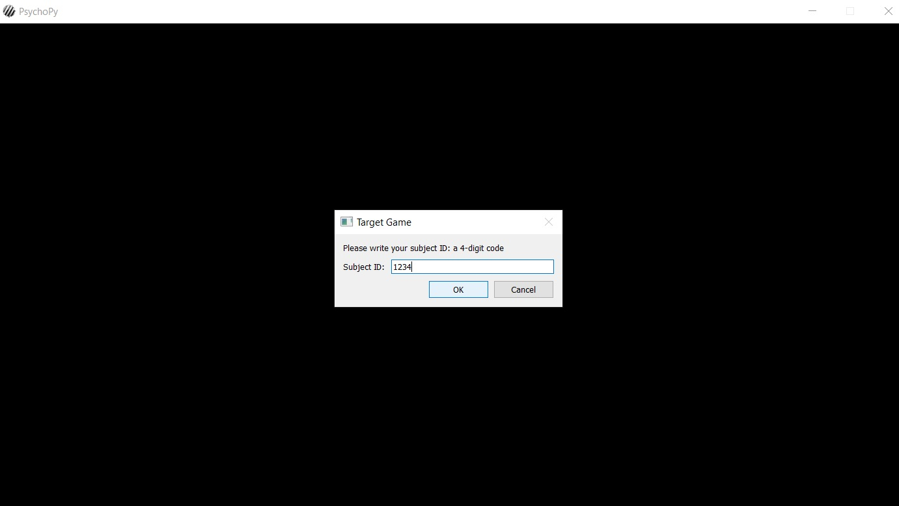
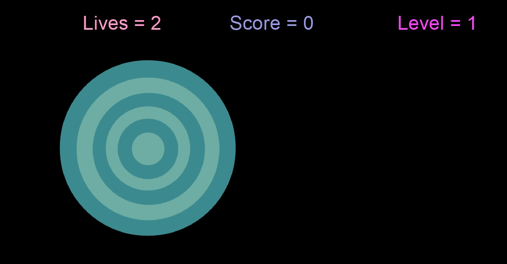
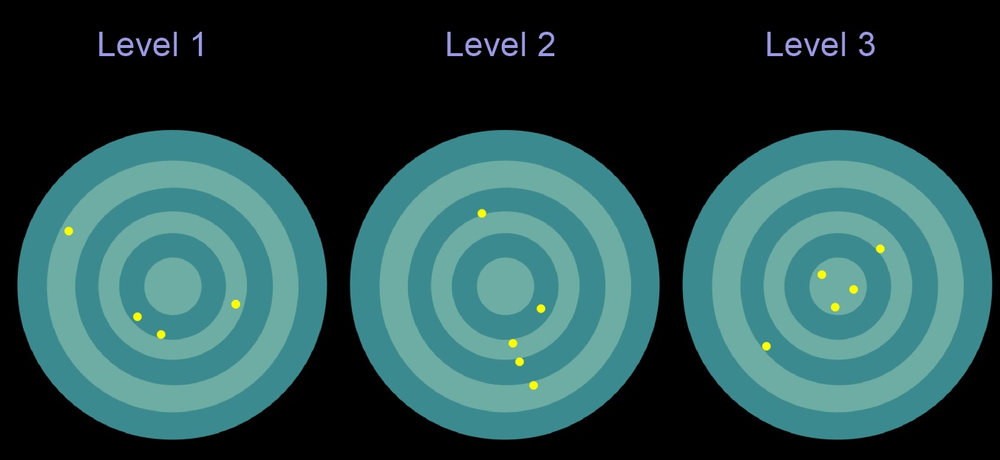
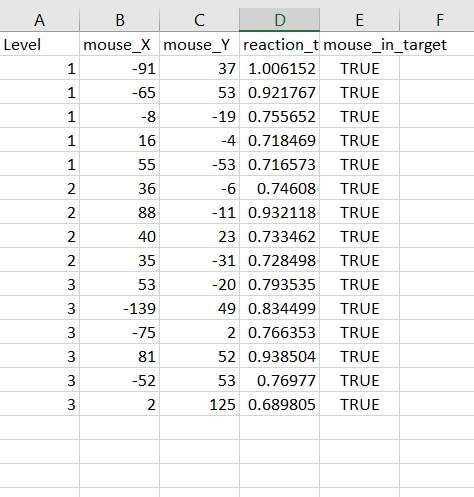
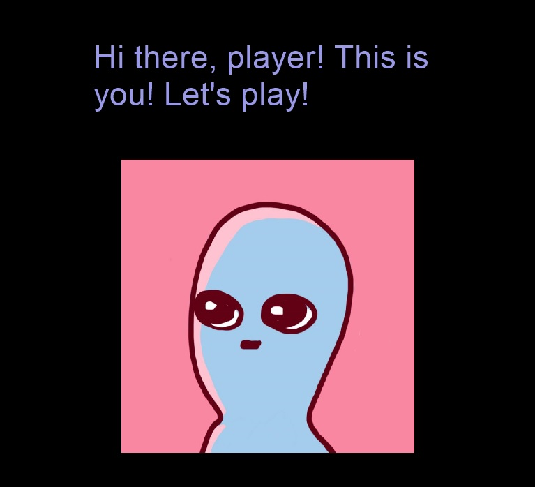
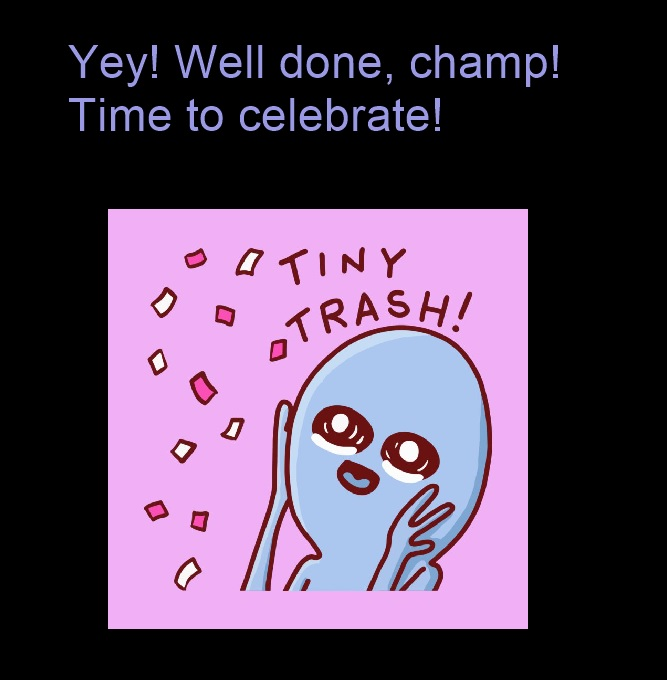
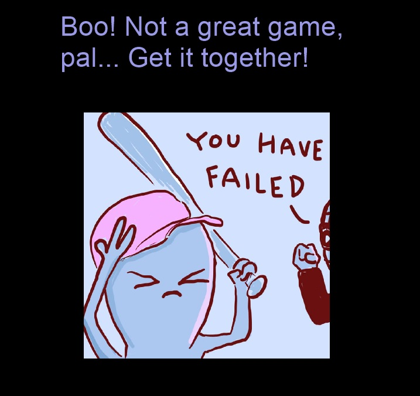

### TARGET GAME

## Instalation and usage

Download the code and start the 'setup.py' file, which will help you install the package `target_game.py`. Once all the instalation reqirements are met and the program has started, the user will be asked for their subject ID and the value entered will be used when outputting the result of the experiment into a CSV file. For example, `results-1234.csv` if the user's subject ID is 1234. Of course, make sure you have Python 3.7 installed. This program also requires the use of psychopy packages. 

## The experiment

The experiment is a game-like scenario that present the user with a target on a black screen. The goal is to 'shoot' at 
the target by using mouse presses. The target moves at a random position on the screen if the mouse is pressed or after a
certain amount of time. The player starts the game with 3 lives and looses a life for every incorrect 'shot' or when the
time to shoot at the target is over. There are 3 levels to the game - each more difficult than the previous one. 
The first level moves the target after 5 seconds (or after a mouse press), the second one - after 3 seconds, and the final 
third one - after 1 second. To go from level 1 to level 2, the user needs to collect 5 points, meaning the player needs to 
successfully shoot at the target 5 times. Level 3 is reached after 10 points, and the game is won after 15 points. The experiment
ends either when the player wins the game, or when the player runs out of lives. At the end of the experiment, the user is
shown an overview of their performance - 3 targets representing the 3 levels appear on the screen and yellow dots mark the
correct shots that the user made. 

## Measurements
The experiment will be used to measure subjects' accuracy, reaction time and precision. The game stores a csv file that
shows the user's performance. In this file are stored: the level of the game, coordinates of the target shot, reaction time,
and whether the shot succesfully hit the target.

## Userface:

The game begins with a short explanation to the user about the purpose of the game. We have also introduced animated characters
adapted from the /Strange Planet/ series to make the interface a bit more playful. Once the game starts, this user inteface is automatically enabled.

SCREENSHOT: TASK

The game also ends with the same animated creatures depicted either in a victory or defeated state. This lets the participant know
whether they have won or lost the game.

## Implementation Details

Please note that the program uses pixels as a main measurement unit. In such a way it is guaranteed that all the images will
be displayed in the correct place and the same size regardless of the user's display (given that we use a hardcoded window size).
The main drawback of this approach is that the experiment may look smaller on very high resolution displays but even then it should
be more than usable.

This could be improved if used different units such as `norm` and `cm`. However, I didn't have enough
time to add this. Given that the improvement this would add wasn't that much, it wasn't high priority.
